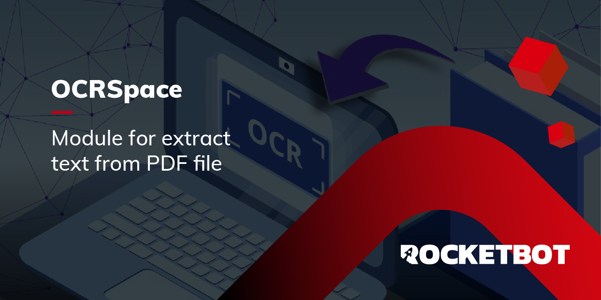

# OCR Space
  
Módulo para aplicar OCR em uma imagem ou arquivo da web
  

## Como instalar este módulo
  
__Baixe__ e __instale__ o conteúdo na pasta 'modules' no caminho do Rocketbot  

## Descrição do comando

### OCR Space converter arquivo
  
Extrair texto de um arquivo.
|Parâmetros|Descrição|exemplo|
| --- | --- | --- |
|Arquivo||arquivo.pdf|
|Key do OCR.Space||12345678|
|Resutlado||Variável|
